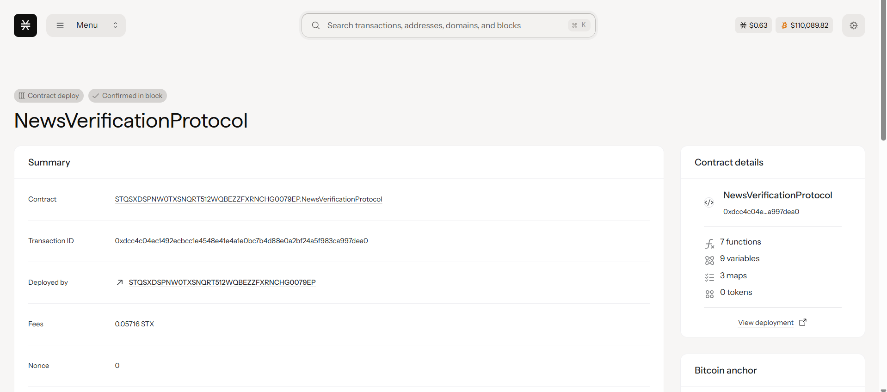

# NewsVerification Protocol

## Project Description

NewsVerification Protocol is a decentralized fact-checking system built on the Stacks blockchain using Clarity smart contracts. The protocol enables community-driven verification of news articles through a reputation-based voting mechanism, promoting transparency and accuracy in information dissemination.

The system allows users to submit news articles for verification, while community members can vote on the accuracy of these submissions. Each vote is weighted based on the voter's reputation score, creating a self-regulating ecosystem that rewards consistent accuracy and penalizes misinformation.

## Project Vision

Our vision is to create a trustless, decentralized infrastructure for news verification that:

- **Combats Misinformation**: Provides a reliable mechanism to identify and flag false or misleading information
- **Empowers Communities**: Gives the power of fact-checking back to the community rather than centralized authorities
- **Rewards Accuracy**: Implements a reputation system that incentivizes honest and accurate participation
- **Ensures Transparency**: All votes and reputation scores are recorded on the blockchain for full transparency
- **Promotes Digital Literacy**: Encourages critical thinking and research skills among community members

## Future Scope

### Phase 1 (Current Implementation)
- ✅ Basic news article submission functionality
- ✅ Community voting with reputation-based weighting
- ✅ Initial reputation system implementation

### Phase 2 (Short-term Roadmap)
- **Enhanced Reputation Algorithm**: Implement dynamic reputation scoring based on voting accuracy over time
- **Category-based Expertise**: Allow users to build reputation in specific news categories (politics, science, technology, etc.)
- **Staking Mechanism**: Require users to stake tokens when voting to increase commitment to accuracy
- **Dispute Resolution**: Implement an appeals process for controversial articles

### Phase 3 (Medium-term Roadmap)
- **AI Integration**: Incorporate AI-powered preliminary fact-checking to assist human validators
- **Cross-chain Compatibility**: Expand to multiple blockchain networks for broader adoption
- **Mobile Application**: Develop user-friendly mobile apps for easier participation
- **API Development**: Create APIs for integration with news websites and social media platforms

### Phase 4 (Long-term Vision)
- **Decentralized Governance**: Implement DAO structure for protocol governance and upgrades
- **Economic Incentives**: Create token rewards for high-quality fact-checking contributions
- **Global Network**: Establish partnerships with news organizations and fact-checking institutions worldwide
- **Educational Platform**: Develop training modules for improving fact-checking skills

### Advanced Features Roadmap
- **Multi-language Support**: Expand verification capabilities to multiple languages
- **Source Verification**: Implement systems to verify the credibility of information sources
- **Real-time Alerts**: Notify users about misinformation in their news feeds
- **Reputation Badges**: Create NFT-based badges for top-performing fact-checkers
- **Integration Ecosystem**: Build plugins for popular browsers and social media platforms

## Contract Address Details
Contract ID: STQSXDSPNW0TXSNQRT512WQBEZZFXRNCHG0079EP.NewsVerificationProtocol

### Mainnet Deployment
- **Network**: Stacks Mainnet

### Testnet Deployment
- **Network**: Stacks Testnet

### Contract Functions

#### Public Functions
1. `submit-news-article(url, title)` - Submit a news article for community verification
2. `vote-on-accuracy(news-id, vote)` - Vote on the accuracy of a submitted article (0 = false, 1 = true)

#### Read-only Functions
- `get-news-article(news-id)` - Retrieve article details and verification status
- `get-user-reputation(user)` - Get reputation score and voting history for a user
- `get-user-vote(news-id, voter)` - Check if and how a user voted on a specific article
- `get-total-articles()` - Get total number of submitted articles
- `get-next-news-id()` - Get the next available news ID

### Getting Started

1. **Submit an Article**: Call `submit-news-article` with the article URL and title
2. **Participate in Verification**: Use `vote-on-accuracy` to vote on submitted articles
3. **Build Reputation**: Consistent accurate voting improves your reputation score
4. **Monitor Progress**: Use read-only functions to track articles and reputation

### Contributing

We welcome contributions from the community! Please check our GitHub repository for open issues and contribution guidelines.

### License

This project is licensed under the MIT License - see the LICENSE file for details.

---

*Building a more trustworthy information ecosystem, one verification at a time.*